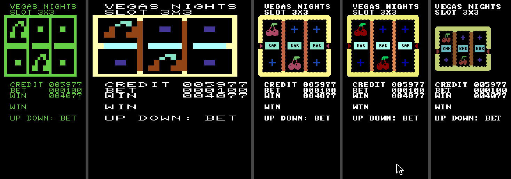
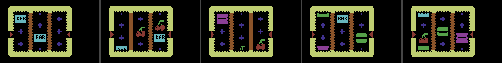
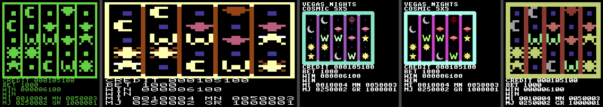
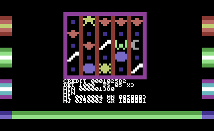
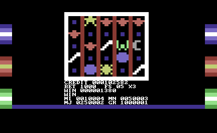
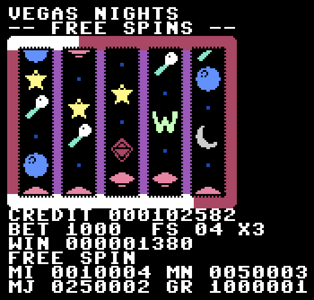

# Vegas Nights

A lab for **modern-style slot machines with real odds**, written in
[8BitScript](https://github.com/8BitScript/8bitscript) and built from one
source tree for the **PET, VIC-20, C64, Commander X16 and the web**.

The ambition is a casino simulation/RPG with several editions (Vegas, Monte
Carlo, Macau, Tokyo, Manila …). The first job is the slot machine: start with a
crude three-reel game, then find out what experience each machine can honestly
give — a bonus round, mini/minor/major/grand jackpots and a progressive meter,
five-reel and 5×5 layouts, and raster tricks inside the reels where the
hardware allows. The odds are computed, not guessed (see
[Generated tables](#generated-tables)).

**What exists today:** the odds engine (`tools/slotmath`), the symbol-art pipeline
(`tools/tiles`), and two slot machines on all five machines: [`slot3x3`](#slot3x3--a-three-by-three-slot-with-three-paylines)
and [`slot5x5`](#slot5x5--a-five-by-five-slot-with-a-bonus-round-and-four-jackpots).

| Program | What it is | Status |
| --- | --- | --- |
| `main` | The lobby: a title screen that says how to run a lab | builds and runs on all five machines |
| `hello-reels` | Three text cells that cycle symbols when you press confirm | builds and runs on all five machines |
| `slot3x3` | A graphical 3×3 slot with three paylines, scrolling reels, bet and win | all five machines; the web needs an 8BitScript newer than 0.24.0 (its glyph table, [below](#where-it-is-not-what-it-should-be)) |
| `slot5x5` | A graphical 5×5 ways slot with a free-spin bonus round and MINI/MINOR/MAJOR/GRAND meters | all five machines |

## Run it

Needs Node 26+ and pnpm 12+.

```sh
pnpm install
pnpm start                      # the lobby on the C64
pnpm start:c64                  # the lobby on a given machine (pet, vic20, c64, cx16, web)
pnpm start:hello-reels:vic20    # a lab on a given machine
pnpm run build                  # every program for all five machines -> dist/
pnpm start:slot3x3:c64          # the slot machine (or :pet :vic20 :cx16 :web)
pnpm run shot:hello-reels       # headless screenshots, all five -> shots/
```

`8bs run <machine>` opens the machine's emulator (VICE for the PET, VIC-20 and
C64, x16emu for the X16, a browser page for the web); `pnpm exec 8bs doctor`
says which emulators this computer has. `--screenshot file.png` captures a
still through the emulator's own API without opening a window; that is what
`pnpm run shot:*` does.

The PET is built as the 32K 4032 and the VIC-20 with the 8K expansion (see
`8bitscript.config.8bs`): the stock 4K PET 2001 and the unexpanded VIC-20 are
below what a lab needs.

### The C64 in the browser (wasm)

`8bs run c64 --web --program slot3x3` runs the C64 build in the editor's WASM tab
or an external browser instead of VICE, and `8bs run c64 --web --program slot5x5
--screenshot out.png` captures what that page draws, headlessly, with no emulator.
It is a model of the machine (text mode, no sprites or sound — `8bs targets --json`
lists the limits), and everything the slots use is in it: the redefined characters
the reels are composed from, the colour RAM, the border and background registers, the
portable raster list the bonus round's copper bars use, and the portable input.
Two files here exist only for it, because the C64's own are machine code the wasm
backend never lowers: `src/shared/glyphs.c64.web.8bs` composes a reel window in plain
loops (the assembly in `glyphs.c64.8bs` is ~6000 cycles of hand-written copy a wasm
build has no use for) and `src/shared/fx.c64.web.8bs` builds the bonus bars through
`@8bitscript/raster` instead of the C64's address-form list. The bars run down the side
borders and the empty rows under the panel; the machine's also run through the border
above and below the 200 picture lines, which a picture-line list cannot name.
`pnpm run test:c64web` runs the same exact-window tests the real machines get against
this build (it needs 8BitScript's `trunk` until a release has the C64 wasm port:
`EIGHTBS_CHECKOUT=/path/to/8bitscript`), and CI runs it.

## Layout

```
8bitscript.config.8bs      programs, targets, baseline, import aliases
src/lobby/                 the `main` program
src/labs/<lab>/main.8bs    one directory per lab; each is its own program
src/shared/                code the labs share (reel scroll, credits, glyph and cell layers)
src/generated/             tables emitted by tools/slotmath (committed)
src/i18n/                  message catalogs (empty so far)
scripts/shot.mjs           headless screenshots for a lab on every machine
.vscode/                   extension recommendation, icon theme, run tasks
```

Imports use two aliases from the config: `@shared/…` and `@generated/…`.

### Adding a lab

1. Make `src/labs/<name>/main.8bs` with an `export function main(): void`.
2. Add `'<name>': { entry: 'src/labs/<name>/main.8bs' }` to `programs` in
   `8bitscript.config.8bs`.
3. Add it to the `lab` list in `.vscode/tasks.json`, and the `start:<name>:*`
   and `shot:<name>` scripts to `package.json` if you want them.
4. `pnpm run build` must still build every program for every machine.

A program name is part of the output name. The PET's disk filenames are 16
characters, and the PET build appends `-pet-4032-32`, so a name of four
characters or fewer fits (`slot` → `slot-pet-4032-32`). A longer one still
builds, with a note that CBM DOS would truncate it on a real disk.

## slot3x3 — a three-by-three slot with three paylines

A real graphical slot machine, not text that looks like one: three reels of art
that scroll pixel by pixel behind a bevelled frame with payline arrows, with the
odds of [`src/generated/classic3x3.8bs`](src/generated/classic3x3.8bs) played
exactly. It runs on all five machines from one source tree.

```sh
pnpm start:slot3x3:c64      # or :pet :vic20 :cx16 :web
```

Confirm spins; up and down change the bet (1×, 2×, 3×, 5× of 100 credits). You
start with 2,000 credits and are re-staked when you run out.

**The rules.** Three reels, three rows, 64 stops a reel. Paylines: the middle
row and both diagonals. A line pays on the longest run of one symbol from the
first reel; a cherry on the first reel pays on its own. The paytable, in credits
at the base bet of 100:

| symbols on a line | pays |
| --- | ---: |
| 7 7 7 | 40,000 |
| BAR3 ×3 | 16,000 |
| BAR2 ×3 | 8,000 |
| BAR1 ×3 | 4,000 |
| cherry cherry cherry | 2,000 |
| cherry cherry | 1,000 |
| cherry (first reel) | 77 |

and a fixed-odds jackpot of 5,000 credits at the base bet on one spin in 512.
**Return to player 93.982%, a win on one spin in 3.50** (28.611%), volatility
6.77 bets a spin — all *exact*, enumerated over all 64³ = 262,144 outcomes by
`tools/slotmath`; the full PAR sheet is [`docs/par/classic3x3.md`](docs/par/classic3x3.md).
The 6502 code is held to it three ways (see [Tests](#tests)): `test/odds.test.mjs`
recomputes the return from the committed table with this repo's own payline
evaluator and must reproduce the engine's figure; and the machines' screens are
compared, pixel for pixel, with what that evaluator says a seeded spin produces.

Credits are exact at every bet. The 6502 backends do not lower 32-bit values, and
a 16-bit balance would quietly pay less than the table promises at the larger bets
(computed: 90.6% at ×5, because a 400× win is 200,400 credits). So the balance
and the win are two limbs of three decimal digits — [`src/shared/bank.8bs`](src/shared/bank.8bs) —
up to 999,999.

### How it is put together

```
src/generated/classic3x3.8bs   the odds (tools/slotmath): strips, paylines, paytable, jackpot
src/generated/tiles/           the art (tools/tiles): per-machine pixel or block tables
src/shared/
  reelscroll.8bs               where a reel is, in pixels, and the staged speed schedule
  feel.*.8bs                   per machine: frames between redraws, pixels per redraw
  glyphs.*.8bs                 per machine: can glyphs be redefined, and how (C64, X16)
  cells.*.8bs                  per machine: write a raw screen code and ink (PET, VIC-20)
  bank.8bs                     exact six-digit credits
  layout.8bs                   where the block sits on a 22-, 40- or 80-column screen
  sound.8bs                    the game's sound hooks (tick / stop / win / big / bonus, mute) over sfx.8bs
src/labs/slot3x3/
  game.8bs                     the machine: spin, stop, evaluate, pay, flash (no pixels)
  view.8bs                     the reels where glyphs can be redefined (C64, X16), and the text fallback
  view.web.8bs                 the reels on the web: pixel-smooth, 16x16 art, composed into its glyph table
  view.pet.8bs view.vic20.8bs  thin wrappers over quad.8bs
  quad.8bs                     the reels from the ROM's quadrant blocks (PET, VIC-20)
```

`game.8bs` knows reels, stops and pixels, never how to draw one. Everything it
draws goes through `view`, and everything machine-specific lives behind one small
twin file per concern, so a second machine type — the 5×5 — is a second data set
over the same files, not a second engine. A reel stop is one random byte & 63
(64 is a power of two, so the draw is exactly uniform) taken in the draw plan's
order; the reels then scroll to their stops, and the win is read off the symbols
they came to rest on.

**How a reel is drawn** depends on what the machine can do:

| machine | how | one pixel step is | measured redraw | program / RAM |
| --- | --- | --- | --- | --- |
| C64 | the reel is 27 redefined characters; a frame rewrites their bytes from the symbol bitmaps, in assembly | 1 pixel | ~0.6 frames a reel | 7,768 B / 103 B |
| X16 | the same, through VERA's data port | 1 pixel | ~0.25 frames | 8,285 B / 197 B |
| PET | the reel is built from the 16 quadrant blocks in the character ROM | 4 pixels (one block row) | ~0.7 frames | 6,008 B / 100 B |
| VIC-20 | the same, with a colour for every cell | 4 pixels | ~0.9 frames | 6,376 B / 99 B |
| web | the reel is 12 redefined glyphs (2 across, 6 down) of the runtime's 80-glyph table, rewritten a pixel row at a time from 16×16 art; every reel every frame | 1 pixel (8 a frame while spinning) | not measured: the runtime redraws the screen from memory | 732 B const / 68 B |

On the glyph machines the screen map never moves: each cell of a reel always shows
the same character code, and a scroll step rewrites only those characters' bytes —
the window of the strip at the reel's pixel offset is copied out of the symbols'
bitmaps, a glyph's eight rows at a time. A cell takes the colour of whichever
symbol cell supplies most of its eight rows.

**How a reel moves.** A spin has five speeds, chosen by how far the reel still has
to go: the machine's *far* hop while more than a few symbols remain, then 12, 8, 4
and finally 2 pixels a redraw, each distance a multiple of the step before, so the
last step lands exactly on the drawn stop with the reel at rest — the picture never
decides the outcome. How often a reel is redrawn and how far it hops far out are
per-machine settings ([`feel.*.8bs`](src/shared)), set from the measured redraw
cost: the C64 steps 12 pixels every second frame, the X16 8 pixels every frame, the
PET and VIC-20 12 pixels (3 block rows) every third frame, and every machine eases
in to 2-pixel (the PET and VIC-20: 4-pixel) steps at the end.

### What a redraw costs

`scripts/measure-redraw.mjs` redraws one reel N times under each machine's own
emulator and finds when the program finishes, so the cost is a number, not a guess:
the C64's was 4.1 frames in compiled script, 2.1 with the copy in assembly, 1.0
with the row maths in assembly and **0.6 with the whole reel in one assembly call**.
Taking the redraw out of compiled code is what makes a reel hop every second frame
possible on a 1 MHz machine.

### Where it is not what it should be

- **The web needs an 8BitScript newer than 0.24.0, and its art is smaller.** The reels
  are composed into the runtime's redefinable glyph table (`@8bitscript/web/charset`,
  8BitScript [#303](https://github.com/8BitScript/8bitscript/pull/303)), which is on
  8BitScript's trunk but in no release: the pinned 0.24.0 has no table, and its runtime would
  put the glyph writes into screen memory. So the web's `view.web.8bs` builds and runs only
  against a newer 8BitScript — `.8bitscript/toolchain.json` pointing at a checkout, or
  `EIGHTBS_CHECKOUT` for the tests — and this lab's CI (which installs the pinned release)
  can build the web again only after a release carries #303 and the pin is raised. The table
  holds 80 glyphs; 24×24 art needs 81 for the reels and 14 for the frame, so the web draws
  16×16 symbols (the theme's `"cells": {"web": [2, 2]}`): 36 glyphs for the reels and 14 for
  the frame, 50 in all. The art is smaller on the screen than on the C64 and X16 and has a
  third of the pixels. Raising the runtime's table past 80 (codes 148–168 and 170–175 are
  free beside 176–255) would allow 24×24 there too; that is an 8BitScript change.
- **The VIC-20 has no RAM character set** here: the 8K program is linked from
  `$1201` upward over `$1C00`–`$1FFF`, the only RAM the video chip can read glyphs
  from, and there is no way yet to reserve a hole in the image. It uses the PET's
  quadrant composer instead, with colour — recognisable, and scrolling in 4-pixel
  steps, but blockier than the C64 and X16.
- **Tearing.** The reel redraw is not synchronised to the raster beam, so a
  headless screenshot taken mid-spin can catch half of one frame and half of the
  next (the tests skip those captures). It is invisible at rest; it reads as motion
  blur while a reel spins.
- **Panels are text.** The credit, bet and win are in the machine's own font; the
  frame, dividers and payline arrows are graphics.
- **The jackpot is fixed-odds**, not a progressive meter, and there is no bonus
  round: that is the 5×5 lab.

### Tests

```sh
pnpm test                 # the odds, from the committed table; no emulator (this runs in CI)
pnpm run test:machines    # every machine, headless, under its own emulator (minutes)
MACHINES=c64,web pnpm run test:machines
```

`test/odds.test.mjs` enumerates all 64³ outcomes through the payline evaluator and
holds the result to the engine's exact RTP and hit frequency, checks that the
strips and the art cover the same symbols, and that the generator's masked stops
are exactly uniform over its whole period.

`test/machines.test.mjs` runs on each machine whose emulator is installed. A ruler
program (two solid blocks) and a glyph sheet calibrate the screenshot to the text
grid; then:

- **exact** — four headless entries play from fixed seeds (a loss, a two-payline
  win, small wins, the jackpot) and each reel on the screen must equal, pixel for
  pixel (C64, X16) or block for block (PET, VIC-20), the picture the oracle says
  the drawn stop gives; WIN, CREDIT and BET must match digit for digit;
- **scrolling** — frame after frame while a spin runs, each reel is at a real
  position on its strip and only ever moves down it;
- **easing** — in the last frames of a spin the steps are small (≤ 12 pixels);
- **the win flash** — the paying lines blink and the reels come to rest as they were.



*The same spin (seed 145: a two-line win) at rest on, left to right, the PET, VIC-20, C64, X16 and web.*

### Per machine, as measured

Numbers are from `pnpm run test:machines` and `scripts/measure-redraw.mjs` on a Mac, NTSC, CLI 0.24.0.

| machine | builds | program / RAM | reels = engine's evaluator | reel hop while spinning | eases to | what it is |
| --- | :-: | --- | :-: | --- | --- | --- |
| C64 | yes | 7,768 / 103 B | exact, pixel for pixel | 12 px every 2nd frame | 2 px | composed glyphs, pixel art |
| X16 | yes | 8,285 / 197 B | exact, pixel for pixel | 8 px every frame | 2 px | composed glyphs through VERA, pixel art |
| PET | yes (4032, 32K) | 6,008 / 100 B | exact, block for block | 12 px (3 block rows) every 3rd frame | 4 px (1 block row) | quadrant blocks, no colour |
| VIC-20 | yes (8K) | 6,376 / 99 B | exact, block for block | 12 px every 3rd frame | 4 px | quadrant blocks, coloured |
| web | yes (needs 8BitScript past 0.24.0) | 732 B const / 68 B | exact, pixel for pixel | 8 px every frame | 2 px | composed glyphs, 16×16 pixel art |

**The web, and why its art is 16×16.** The pixel composer needs, per reel, one glyph for every
cell of a three-symbol window: 27 at 24×24, 81 for three reels, and 14 more for the machine's
frame — 95 against the web's 80. At 16×16 (two cells a symbol) it is 12 a reel, 36 in all, and 50
with the frame, so the web gets the same composed, pixel-smooth reels as the C64 and X16 with real
tile art, from `view.web.8bs`, which reads every size from the tile data. The cost is a smaller
picture. Run it with an 8BitScript checkout (see above); `pnpm run test:machines` skips the web
by name when it has none (`EIGHTBS_CHECKOUT=/path/to/8bitscript MACHINES=web pnpm run test:machines`).

The web, a few frames into a spin (frames 33, 38, 41, 46 and 52 of the `lines` entry): the reels
slide down by whole pixels, with a symbol cut by the window's edge, in the same pixel art as at rest.



## slot5x5 — a five-by-five slot with a bonus round and four jackpots

A graphical 5x5 slot on all five machines: five framed reels of art that scroll pixel by
pixel (or quadrant row by quadrant row), paid by *ways* — a symbol pays on its longest run of
adjacent reels from the first that each show it, or a wild, anywhere in the window, times the
number of ways — with a free-spin bonus round and four progressive jackpot meters, played at
the exact odds of [`src/generated/grid5x5.8bs`](src/generated/grid5x5.8bs).

```sh
pnpm start:slot5x5:c64      # or :pet :vic20 :cx16 :web
```

Confirm spins; up and down change the bet (1×, 2×, 3×, 5× of 1,000 credits). You start with
100,000 credits and are re-staked when you run out.



*The same spin (seed 33: a 6,100-credit win) at rest on, left to right, the PET, VIC-20, C64, X16 and web.*

**The rules** (the proof is [`docs/par/grid5x5.md`](docs/par/grid5x5.md)). Five reels, five rows,
32 stops a reel (so one random byte & 31 is an exactly uniform stop), 9 symbols (STAR, MOON, SUN,
COMET, ORB, RING, BLANK, WILD, SCATTER). Low symbols pay from four of a kind, the top three from
three; the wild substitutes for every symbol but the scatter. **Three or more scatters anywhere**
pay and start the **bonus round**: 8, 12 or 20 free spins at **triple wins**, with scatters inside
the round awarding more (a retrigger), up to 50 free spins in all. **MINI, MINOR, MAJOR and GRAND**
are mystery jackpots — one 16-bit draw on every base spin, split into disjoint ranges (1 in 1,024,
4,096, 21,845 and 65,536), each opening at a higher bet (1×, 2×, 3×, 5×). Each is a meter that starts at
its seed (10,000 / 50,000 / 250,000 / 1,000,000 credits at the base bet), grows with every bet, and
resets to the seed when it is won.

| | exact |
| --- | --- |
| **Return to player** | **94.049%** (base game 64.303%, bonus round 23.878%, jackpots 5.868%) |
| Hit frequency | a win on one spin in 1.23 |
| The bonus round opens | about one spin in 74 |
| Volatility | 5.549 bets a spin |

The base game's share is held to the engine *over all 33,554,432 reel positions* by
`test/odds5.test.mjs`, and the bonus round's rules (triple wins, retrigger, the cap) by
simulation with a proper generator; see [Tests](#tests-1).

**Rules this lab adds that the table does not fix.** A jackpot's meter grows by `JACKPOT_CONTRIB_Q8 / 256`
credits for every *base bet* of a spin (so a bet of ×5 feeds it five times as much) and is paid as it stands, not
multiplied by the bet; a bet below a jackpot's opening bet cannot win it. Free spins cost nothing, take no
jackpot draw, and leave the meters alone. These are this game's choices, written in `game.8bs` and
`test/support/reference5.mjs` and tested against each other; the engine's PAR sheet is for the
bet-funded meter at its opening bet.

Credits are exact to 999,999,999: [`src/shared/purse.8bs`](src/shared/purse.8bs) keeps each number as three
decimal limbs of three digits, because the 6502 backends do not lower 32-bit values and the GRAND
seed alone is 1,000,000.

### The bonus round's full-screen look (`fx`)

While the free spins run, the game calls three hooks (`fx.begin()`, `fx.frame(tick)`, `fx.end()`) that a
machine can fill in with something that happens to the whole picture rather than to the reels. The
portable file [`src/shared/fx.8bs`](src/shared/fx.8bs) does nothing and costs nothing (the four
6502 builds are byte for byte the size they were), and a machine that can do better replaces it with
its own `fx.<machine>.8bs`. Today only the web has one: copper bars in the border and in the rows
under the panel, scrolling down the screen, with the panel and reels left on black.




[`docs/fx.md`](docs/fx.md) is the brief for writing the others (C64, X16, VIC-20, PET): the surface,
what the game promises, what each machine's raster layer gives, and how to prove an effect on screen.
`test/fx.test.mjs` (in CI) holds every twin to the same four members; `test/fx.machines.test.mjs`
(`pnpm run test:machines`) checks the border is plain before the round, barred and moving during it,
and plain again after.

### How the 5x5 is put together

```
src/generated/grid5x5.8bs        the odds (tools/slotmath): strips, paytable, scatter pays, free-spin awards, jackpots
src/generated/tiles/cosmic*.8bs  the art (tools/tiles): 16x16 symbols on the C64/X16/web tileset, 6x6 quadrant ones on the PET/VIC-20
src/shared/purse.8bs             exact credits, nine digits, in named registers (balance, win, session, four meters)
src/shared/glyphs.*.8bs          + the pre-composed strip buffer and the straight copies out of it
src/labs/slot5x5/
  game.8bs                       the machine: spin, stop, ways, scatters, free spins, jackpots, pay, flash (no pixels)
  spin.8bs                       how a reel moves: the 3x3's schedule with a symbol 16 or 24 pixels tall
  view.8bs                       the reels where glyphs can be redefined (C64, X16); a text fallback elsewhere
  view.pet/vic20/web.8bs         thin wrappers over quad.8bs
  quad.8bs  quadcode*.8bs  ink*.8bs   the quadrant-block composer, its block codes and its colours
```

The **language cannot pass an array to a function**, so a reel view has to name its own tables:
`view.8bs` and `quad.8bs` are per-lab copies of the 3x3's, with their geometry (five reels, a window
of five symbols, 2 or 3 cells a symbol) in constants; everything that does not name a table —
`purse`, the glyph and cell layers, `layout`, `feel`, `sound` — is shared with the 3x3.

**How a reel is drawn** depends on what the machine can do:

| machine | how | one hop is | program / RAM |
| --- | --- | --- | --- |
| C64 | each reel is **20 redefined characters** (two cells by ten) holding a window of five 16x16 symbols. At start-up every reel's two glyph columns are laid out as whole strips of bytes in RAM (512 rows a column + the first 80 again), so a window at *any pixel offset* is ten glyphs' worth of **consecutive bytes**: a redraw is two straight copies in assembly, and the colours are copied the same way | 8 pixels | 10,899 B / 105 B |
| X16 | the same, through VERA's data port, the colours written cell by cell (it is fast enough) | 8 pixels | 17,173 B / 176 B |
| PET | the reel is built from the 16 quadrant blocks in the character ROM (a symbol is 6x6 of them, a reel 15 cells by 3), no colour | 12 pixels | 9,077 B / 95 B |
| VIC-20 | the same, with a colour for every cell | 12 pixels | 9,686 B / 96 B |
| web | the same quadrant composer on the host font's 2x2 blocks (codes 128-143, in the very order the composer works out), in colour | 8 pixels | 1,160 B const / 161 B |

Why 16x16 and not the 3x3's 24x24 on the glyph machines: five reels of 24x24 symbols are 225 glyphs
against the 127 codes free on the C64 and X16; the 16x16 art (two cells a symbol) needs 100 for the reels and 14 for
the frame. The web has 80 redefinable glyphs, 20 short of that, so it takes the quadrant route instead — which
needs no glyphs at all.

**Floors.** The VIC-20 build needs the 8K expansion (9,686 B of program against an 11,775-byte ceiling;
the unexpanded machine's 3,583 and the +3K's 6,655 are short by 6,103 and 3,031 bytes); the PET needs 16K
or more (9,077 B against the 15,359 of the 16K model; the 8K model's 7,167 is 1,910 short). These are arithmetic against the catalog's
`memory.ram`; the config builds the PET as the 32K 4032 and the VIC-20 with 8K.

### Where it is not what it should be

- **The reels move slower than the 3x3's.** Five reels redraw in the time three did, so a C64 reel
  hops 8 pixels about every third frame (about 3 pixels a frame), the PET and VIC-20 hop 12 pixels
  every few frames, and the VIC-20 is the slowest (about 1 pixel a frame). It reads as a spinning
  reel, not as a blur; redrawing the quadrant reels in assembly, as the C64's are, is the way to more.
- **The bonus round is not yet a mode of its own.** It changes the frame's colours every few frames,
  the title for a "FREE SPINS" banner where the screen has one, and shows the counter and ×3; the
  full-screen, demoscene-style presentation (raster bars, palette cycling, a different reel set) is the next step.
- **The jackpots are standalone meters**, not linked between machines, and reset when the program does.
  A jackpot win shows the message and the meter reset; there is no celebration yet.
- **No sound** beyond the empty hooks in `src/shared/sound.8bs`.
- **Tearing.** The reel redraw is not synchronised to the raster beam, so a headless screenshot taken
  mid-spin can catch half of one frame and half of the next (the tests allow for it). It is invisible at rest.
- **Panels are text**; the frame, dividers and the reels are graphics.

### Tests

```sh
pnpm test                 # the odds: both slots, from the committed tables; no emulator (this runs in CI)
pnpm run test:machines    # every machine, headless, under its own emulator (many minutes; the X16 runs in real time)
MACHINES=c64,web node --test test/slot5x5.machines.test.mjs
```

`test/odds5.test.mjs` runs the 5x5's rules, in JavaScript, over every one of the 33,554,432 reel positions and
requires the mean to equal the engine's exact ways + scatter return (61.132% + 3.171%) to within 1e-12; plays
300,000 spins of the full rules with a proper generator and requires the return including the bonus round
to be the engine's (88.18% without the jackpots) to within sampling error; holds the jackpot seeds `game.8bs` keeps
by hand (the 6502 backends cannot read the generated 32-bit ones) to the generated file's; and checks that each
headless entry's seed shows what the entry is for.

`test/slot5x5.machines.test.mjs` runs on each machine whose emulator is installed. A ruler program calibrates
the screenshot to the text grid and the 3x3's glyph sheet names the digits; then:

- **exact** — three headless entries play one spin from a fixed seed (a loss; a 6,100-credit win on several ways at once;
  the MINI jackpot) and each of the five reels on the screen must equal, pixel for pixel (C64, X16) or quadrant block for
  block (PET, VIC-20, web), the picture the oracle says the drawn stop gives; CREDIT, BET, WIN and all four jackpot meters
  must match digit for digit;
- **the bonus round** — from the entry whose first spin lands three scatters, the free-spin counter is read at five points of
  the round (counting down from 8, never above what was granted), and once the round is over the credit is exactly the
  oracle's: eight free spins at triple wins; and for the entry whose round retriggers (16 free spins), the same, which holds
  the retrigger and the cap to the oracle too;
- **scrolling** — sampled frame after frame while a spin runs, every reel is at a real position on its strip and only
  ever moves down it.



*The bonus round on the C64, mid-round: the banner, the free-spin counter (FS 04 X3), the frame pulsing.*

### Per machine, as measured

Numbers are from `pnpm run test:machines` on a Mac, NTSC, CLI 0.24.0.

| machine | builds | program / RAM | reels = the oracle's | bonus round (8 and 16 free spins) = the oracle's | reels move (measured) | what it is |
| --- | :-: | --- | :-: | :-: | --- | --- |
| C64 | yes | 10,899 / 105 B | exact, pixel for pixel | exact credit | 8-pixel hops, about 2.7 px a frame | composed glyphs, pixel art, colour |
| X16 | yes | 17,173 / 176 B | exact, pixel for pixel | exact credit | 8-pixel hops, about 3.5 px a frame | composed glyphs through VERA, pixel art, colour |
| PET (4032, 32K) | yes | 9,077 / 95 B | exact, block for block | exact credit | 12-pixel hops, about 3.4 px a frame | quadrant blocks, no colour |
| VIC-20 (8K) | yes | 9,686 / 96 B | exact, block for block | exact credit | 12-pixel hops, about 1 px a frame | quadrant blocks, coloured |
| web | yes | 1,160 B const / 161 B | exact, block for block | exact credit | 8-pixel hops every frame, about 8 px a frame | quadrant blocks on the host font, coloured |

Every cell above passed in one full run of `test/slot5x5.machines.test.mjs` on each machine against the code in this change
(7 tests a machine). "About N px a frame" is the mean step between screenshots taken five frames apart while a spin runs
(a frame is the machine's 50 or 60 Hz refresh; the web's is the host's), so it is a mean over hops, not a hop.

## Cursor / VS Code

Open this folder in Cursor and accept the recommended extension,
`8bitscript.8bitscript-lang` (from Open VSX in Cursor). It gives `.8bs`/`.8bx`
syntax colouring, diagnostics, hover, go-to-definition and completion through
`8bs lsp` from this project's own `node_modules`, the file icons, and the
launcher view that reads `8bitscript.config.8bs`.

The extension's Run and Build buttons do not name a program, so they run
`main` (the lobby). To run a **lab**, use **Terminal → Run Task → Run lab** and
pick the lab and the machine, or a `pnpm start:<lab>:<machine>` script.

Known problems with the toolchain this was built on (0.24.0), found while
setting this up:

- **False `8BS2001 … cannot find package '@8bitscript/c128'` errors** on every
  `import … from "@8bitscript/text"` (also `screen`, `input`) in the editor and
  from `pnpm run check`, because the resolver looked in the wrong place under
  pnpm. Fixed in 8BitScript
  [#297](https://github.com/8BitScript/8bitscript/pull/297); until a release
  carries it, expect those squiggles. Builds are not affected, so CI does not
  run `pnpm run check` yet.
- **`random.range(n)` does not build** on the 6502 machines in 0.24.0 (fixed on
  8BitScript trunk, #298). The slot draws a reel stop from `random.next() & 63`:
  64 stops is a power of two, so that is exactly uniform.

## Generated tables

Slot odds are computed offline and committed as `.8bs` data. `tools/slotmath/`
(arriving in its own change) enumerates every reel-stop combination of a
machine's definition, proves its return-to-player and hit frequency exactly,
and writes the reel strips and paytables to `src/generated/`. A lab imports
those tables as `const` arrays, so they live in the program image, not RAM.
Nothing is hand-tuned in a lab, and changing a paytable means regenerating and
re-reading the proof.

## Sound

`src/shared/sfx.8bs` is the slot machines' sounds — a reel tick, a reel stop,
a small win, a big win and the bonus fanfare — through `@8bitscript/audio`'s
`audio.tone`. Call `sfx.update()` once a frame instead of `audio.update()`, and
`sfx.tick()`, `sfx.stop()`, `sfx.win()`, `sfx.big()`, `sfx.bonus()` when
something happens. A jingle is a run of (note, frames) steps in two const arrays,
so it is data in the program image; a new effect cuts the one sounding off. All
notes are inside C4..B5 (the `.8ba` index 48..71), the range the PET's one-bit
speaker, the VIC-I, the SID and the X16's PSG all play without moving a note by
an octave. A sound is timed in calls of `sfx.update()`: a loop that overruns a
frame stretches a sound by that frame.

`pnpm run start:sound-test:<machine>` is the lab: it plays all five effects once
as it starts, then up/down choose and confirm plays. `pnpm run sound` is the
check: it builds the lab, records each machine's audio headlessly (VICE in
console mode at 2% volume, x16emu on SDL's dummy drivers, the web as the
rendered register timeline of the compiled program) and measures the pitch of
every note of every effect against the note it names. No window opens and
nothing worth hearing plays. It needs an 8BitScript checkout that has
`audio.tone` (`EIGHTBS_CHECKOUT`, default `../8bitscript`); the recording of
VICE's audio needs macOS.

What that check found: every note of every effect is the pitch it names on the
C64 (it reads the SID's registers: exact), the X16 and the web (exact), the PET
(a recorded WAV; a 50 ms note has only a few cycles to count, so those read to
about 40 cents and the long ones to within a few), and within the VIC-I's own
7-bit divisor on the VIC-20 (up to 50 cents flat or sharp; its table is NTSC and
a PAL VIC-20 plays about a semitone and a half sharp). The web's sound has **not been heard**: no
browser tab was available. One VIC-20 step is a frame long: the first step of
`big` measures 4.95 frames where its neighbours measure 4.00, and the cause is
not found.

`audio.tone` and `audio.NOTE_HIGH` are in 8BitScript's trunk, not in the
released 0.24.0, so `sound-test` does not build with the pinned CLI until the
release after that. CI builds with 8BitScript's trunk until then (the comment
in `.github/workflows/ci.yml` says how to go back); on a developer machine set
`EIGHTBITSCRIPT_CHECKOUT` to an 8BitScript checkout.

### Sound in the slot

`slot3x3` plays its sounds through `src/shared/sound.8bs`, which is `sfx` behind
a mute switch. What you hear: a tick as the reels step (once a frame, however many
reels moved), a stop as a reel comes to rest, and when the spin settles a win
jingle for a pay, a longer one for a big pay (twenty bets or more, `BIG_WIN` in
`game.8bs`), the fanfare for the jackpot, and for a loss the last reel's stop.
The cancel key mutes and unmutes. A frame plays at most one effect, and the frame
that settles the spin plays only its result: a stop struck under the jingle would
leave the SID's gate open, so the jingle's first note would not retrigger.

What it costs (`8bs build --target <t> --program slot3x3`, program bytes /
variable bytes, before sound, after):

| machine | before | with sound | added |
| --- | --- | --- | --- |
| PET 4032 32K | 6008 / 100 | 6689 / 108 | +681 / +8 |
| VIC-20 8K | 6376 / 99 | 7172 / 108 | +796 / +9 |
| C64 | 7768 / 103 | 9241 / 114 | +1473 / +11 |
| X16 | 8290 / 197 | 9334 / 197 | +1044 / 0 |
| web (const data) | 732 / 68 | 798 / 74 | +66 / +6 |

`pnpm run sound:slot` is the check that a spin sounds right. It builds the four
headless slot programs (a loss, a small win, a big win, the jackpot), whose last
spin's result the odds oracle knows, records each machine's audio, and compares
the LAST sound with the effect that result calls for, note by note (and that
reel ticks and stops came before it). The SID and the VIC-I are read from VICE's
register dump, the web from its per-frame voice, and the PET and X16 from the
WAV: there the notes are the pitches that hold for a few milliseconds, in order,
because a recording's time is not the logical frame (the PET's frame measures
about 58 Hz, the X16's steps are not evenly spaced in the WAV). Like `pnpm run
sound` it needs an 8BitScript checkout with `audio.tone` (`EIGHTBS_CHECKOUT`,
default `../8bitscript`, and `EIGHTBITSCRIPT_CHECKOUT` for the cli) and macOS for
VICE's audio. The on-screen tests (`pnpm run test:machines`) take the same
`EIGHTBITSCRIPT_CHECKOUT`.

## The baseline

`baseline: 'c64'` in the config names the machine the labs are designed on.
`pnpm run build` (`8bs build --release`) prints, per artifact, what that build
is short of the baseline in the facts a program tests.

## CI

`.github/workflows/ci.yml` calls 8BitScript's reusable compile workflow, which
runs `8bs build --release` — every program on every machine — with the CLI
version pinned in `package.json`. A second job, `c64web`, runs the on-screen tests
(`pnpm run test:c64web`) against the C64 built through wasm: exact reel windows, credit,
win and jackpot meters for the 3x3 and the 5x5, the free-spin rounds, the bonus bars.
They need no emulator, which is why they can run on a runner at all; the same tests
against the real machines (`pnpm run test:machines`) need VICE and x16emu.

## License

MIT.

## Symbol art

Slot symbols are pictures turned into per-machine tables at build time by `tools/tiles` — real 24x24 pixel art on the C64, VIC-20, X16 and web, ROM block glyphs on the PET. Themes live in `assets/themes/`; see [docs/tiles.md](docs/tiles.md) and the contact sheets in `docs/tiles/`. `pnpm run test:tiles` runs the unit tests and, where VICE and x16emu are installed, checks the on-screen result pixel for pixel.
