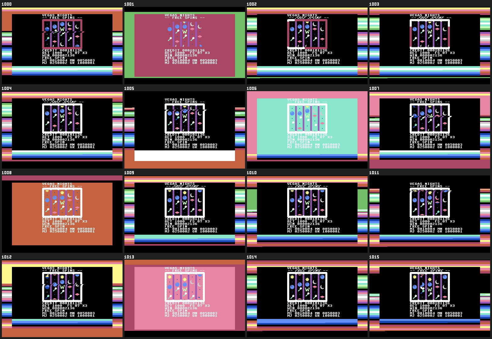
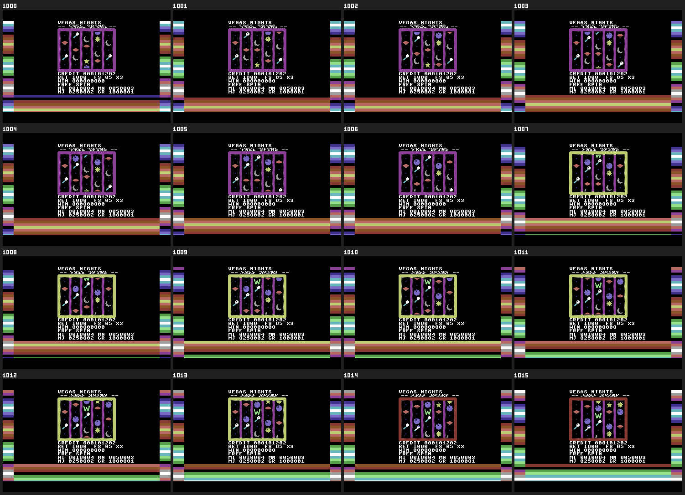
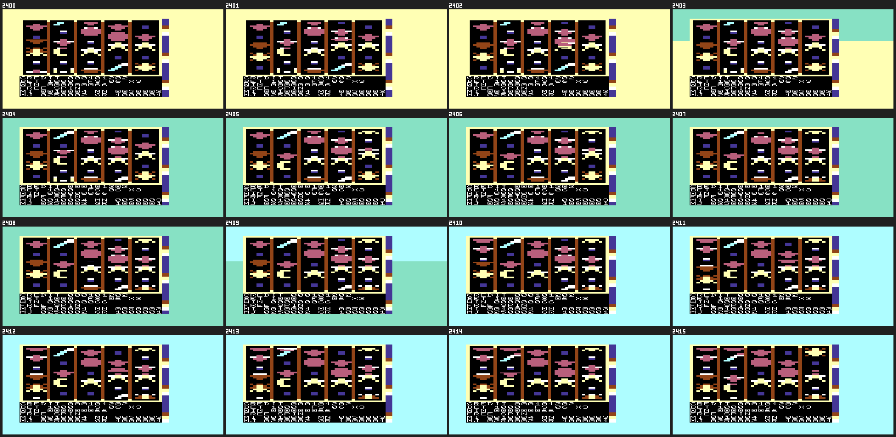
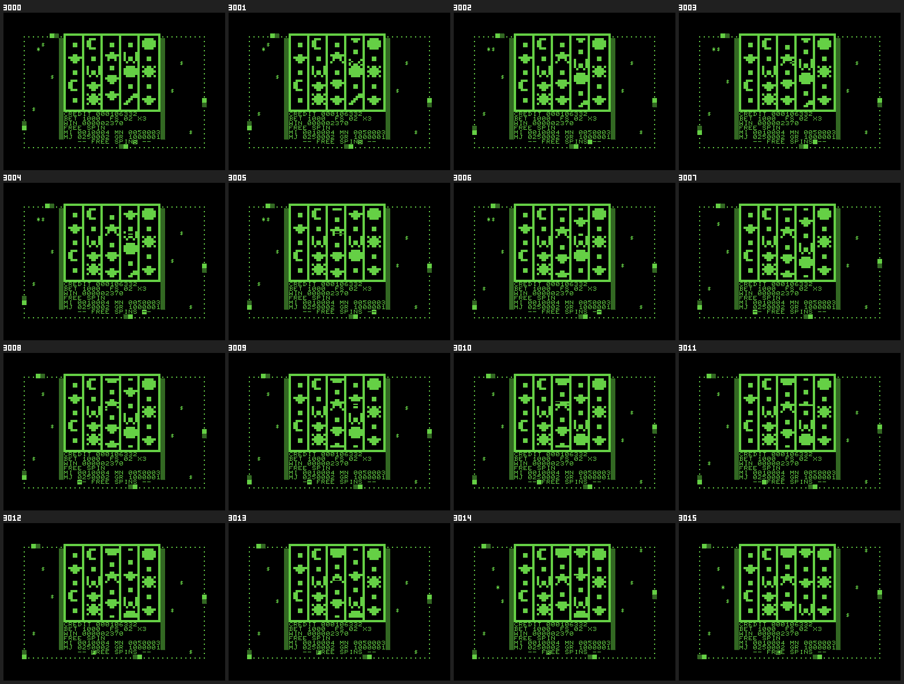
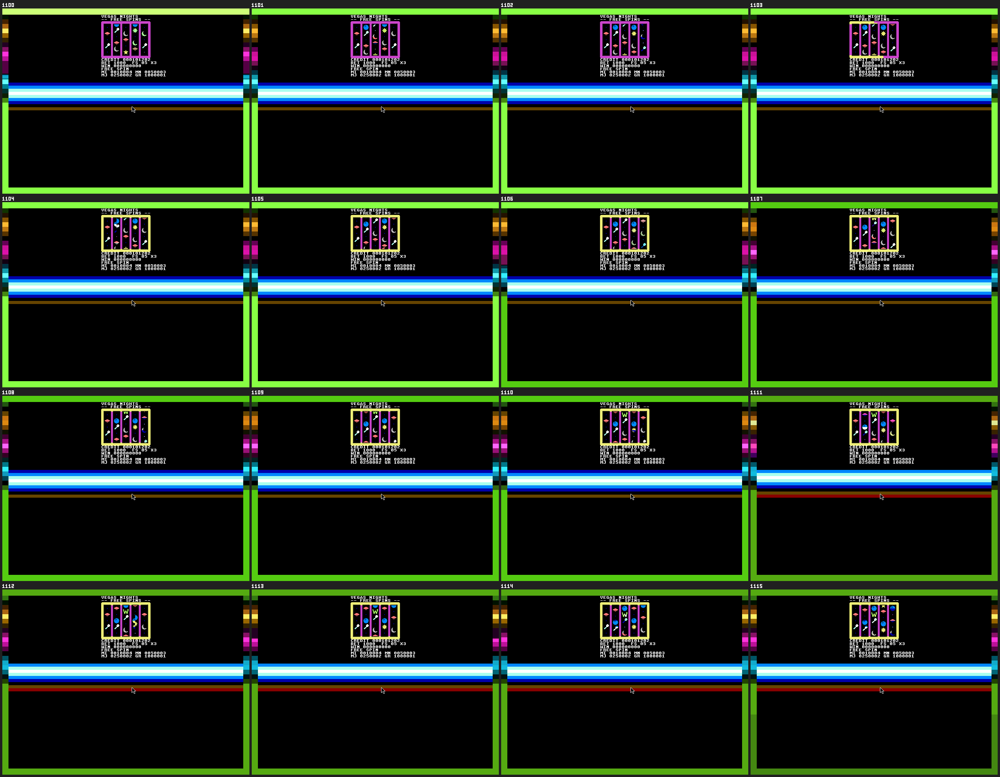
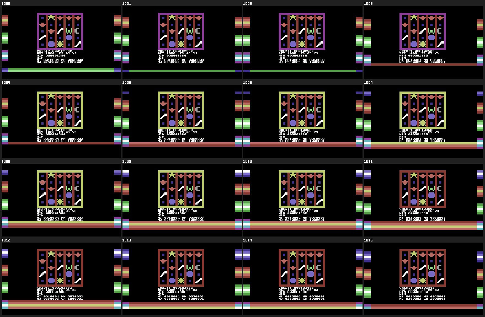
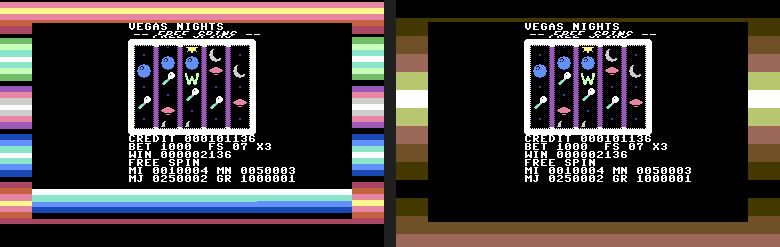
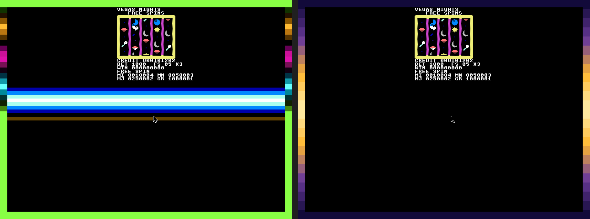

# The bonus round's look: what it does, and what it should do

The owner ran the 5×5's free-spin bonus on the real emulators and said it "looks really janky … an
explosion of color and weird artifacts that don't look good." That is right, and it is
measurable. The first version of this effect was judged from **single screenshots**, and a single
screenshot cannot show a flash, a stripe that jumps, a seam, or a banner that shreds. This document
makes the motion visible, says what is wrong on every machine with the evidence, and proposes one
art direction with hard constraints for each machine, for the owner to approve **before any code
changes**. Nothing in `src/` was touched to produce it.

- [How the evidence was made](#how-the-evidence-was-made)
- [What is wrong, machine by machine](#what-is-wrong-machine-by-machine)
- [Why: what the evidence says about the cause](#why-what-the-evidence-says-about-the-cause)
- [The proposed direction: "Gold"](#the-proposed-direction-gold)
- [Hard constraints, per machine](#hard-constraints-per-machine)
- [Technical constraints, per machine](#technical-constraints-per-machine)
- [Decisions for the owner](#decisions-for-the-owner)
- [Not covered here](#not-covered-here)

## How the evidence was made

`scripts/motion.mjs` captures **consecutive video frames** of the seeded, forced bonus round (the
`slot5x5-bonus` program, the one `test/fx.machines.test.mjs` uses) on every machine and stitches
them into things an eye can read. Re-run it with the local 8BitScript checkout:

```sh
EIGHTBS_CHECKOUT=/path/to/8bitscript node scripts/motion.mjs all c64      # c64 vic20 pet web c64web
EIGHTBS_CHECKOUT=/path/to/8bitscript node scripts/motion.mjs all cx16     # one x16emu recording
node scripts/motion-plan.mjs c64                                          # the before/after sketch
```

| Machine | How the frames are taken | Frames |
| --- | --- | --- |
| C64, VIC-20, PET | one deterministic boot per frame; VICE's `--frames` is an exact cycle count | 16 consecutive, plus 48 at every 3rd |
| C64 in wasm, web | the wasm build run for exactly N `waitFrame()` calls | same |
| X16 | one `x16emu -gif` recording, frames pulled out by index with ffmpeg | frames 1100–1259 |

For each machine, `docs/motion/<machine>/` holds:

| File | What it shows |
| --- | --- |
| `consecutive-16.png` | 16 consecutive frames in a labelled grid. **Start here.** |
| `bonus.gif` | the same 16 frames, animated at 10 fps (slowed from 50–60) |
| `spacetime-every-frame.png` | one border column per frame, side by side. A stripe scrolling at a steady speed is a **slanted band**; a static one a vertical band; a stripe that stalls then jumps is a **staircase**; a flash is a **full-height vertical streak** |
| `spacetime-every-3rd.png` | the same over 48 frames at every third frame |
| `analysis.json` | the numbers quoted below |
| `plan-before-after.png` | (C64, X16) a real frame beside the same frame with the proposed look |
| `detail-banner.png`, `detail-reels.png` | (C64) close-ups of the banner and the top reel row |

**One caveat about VICE captures.** `-exitscreenshot` stops at a cycle count, so a capture can fall
mid-frame. A seam that sits at the *same* row in every changing frame would be the capture; seams
that move are the machine. The C64's flashes are whole-frame solid fills, which no capture position
can produce, so they are not an artefact. Where a seam could be the capture it is marked below.

## What is wrong, machine by machine

All numbers are from the 58 captured frames per machine (16 consecutive, 48 at every third, 6
shared) unless a smaller set is named. "Border changed" is the share of border pixels that differ
from the previous frame.

### C64 (x64sc, NTSC): the worst of them



- **Whole-screen flashes.** In **4 of the 16 consecutive frames (1001, 1006, 1008, 1013) and 10 of
  58 overall (17%)** the entire playfield turns one solid colour for a single frame (maroon, teal,
  orange …) with the reels floating on top. At 50–60 frames a second, one frame in four is a strobe.
  This is the "explosion of color". It does **not** happen in the same program built through wasm
  (0 of 58), so it comes from the real raster timing, not from the design of the effect.
- **A stripe that stalls and jumps.** The border column's shift per video frame is
  `[9, 1, 0, 6, 0, -24, 0, 24, 22, 0, 0, 0, 8, 1, 0]` lines: it stands still for several frames,
  then moves four stripes at once. The wasm model of the *same code* steps a clean
  `[6, 0, 6, 0, 6, 0 …]`. In the space-time diagram the real C64 is a staircase of broken bands and
  vertical streaks; the wasm one is a regular slant.
- **Too much changing.** In **14 of the 15 frame-to-frame intervals, 40–94% of the border's pixels
  change** (mean 66% over all 15; the 15th interval is a stall with 0%), and one frame shows 13
  distinct colours at once in a single border column.
- **The banner shreds.** The `-- FREE SPINS --` wobble gives each pair of scanlines a different
  horizontal offset, so at a sway of a few pixels the word is sliced into sheared fragments
  (frames 1002, 1003, 1004, 1009 in the close-up). It is unreadable on those frames.
- **The reels' top row tears.** In frames 1000, 1005, 1007 the first row of symbols is displaced
  sideways with jagged edges: the wobble's reset back to 0 lands late, so its offset leaks into the
  first reel row.
- **Colour clash.** The reel frame changes colour (purple → white → maroon) independently of the
  border, in the same frames as the flashes.

Close-ups: [banner](motion/c64/detail-banner.png), [top reel row](motion/c64/detail-reels.png).

### C64 in wasm: the intended design, cleanly timed



No flashes (0 of 58), steady 6-line steps every second frame. It shows what the effect looks like
when the timing is exact, which is the useful part: **even then it is too busy** (13 colours in a
frame, 80% of the border changing every other frame, bars in four unrelated hues) and the banner
is still sheared by the wobble.

### VIC-20 (xvic, NTSC)



- **A bright pastel wash over the whole screen.** Everything outside the machine goes one saturated
  pastel (yellow → mint → pale cyan), the loudest thing on screen, with no black playfield.
- **The change lands mid-frame.** Frames 2403 and 2409 are split: new colour in the upper part, old
  in the lower, at a different row each time (about a third and a half of the way down). Across the
  58 frames, **5 are torn** (2403, 2409, 2463, 2469, 2478). The seam moves, so it is the machine and
  not the capture position.
- **Cadence.** The colour steps every 6–9 video frames (about 7–10 a second), not "every second
  frame": the effect counts game-loop iterations, and the 5×5's quadrant composer makes an
  iteration take several video frames.
- The marquee in the last column is a thin blue strip with three moving lights; it is the one part
  that reads as intentional.

### PET 4032 (xpet)



The calmest by far: 2 colours, **about 1% of the picture changes per frame** (mean 1.1%), no flashes. The ring of
dots, the coins and stars and the banner scanner read as a quiet "something is happening". Its
problems are small: the single `$` and `*` characters blinking on and off at scattered cells look like
screen noise rather than confetti, and the reel cells show half-drawn symbols while a reel is still
being composed (frames 3001, 3004). That tearing is the existing spin composer, not the bonus effect.

### Commander X16 (x16emu)



- **Too many hues, and they fight.** A lime-green border, magenta/orange/cyan side stripes, a
  blue-to-white-to-cyan glow band across the full width, a brown line below it, a yellow reel frame
  and a magenta reel divider: 35 distinct colours in one frame, 22 in a single border column.
- **Irregular.** Six of the 15 frame-to-frame intervals change nothing in the border; the others change
  between 3% and 100% of it (all of it at once going into frame 1111), consistent with the effect
  advancing on loop iterations, not video frames.
- **The glow band is harsh.** A hard-edged white-and-cyan bar crosses the screen under the panel.
- **The mouse pointer is on screen** (the white arrow in the middle of the black area), which is not
  part of the game.
- **The machine occupies roughly a fifth of the screen**, in the top left of a 640×480 picture; the
  rest is black. See the plan sketch, and [Not covered here](#not-covered-here).

### Web



Regular (no flashes, a steady 8-line step every second frame) but busy: 12 colours in a frame, the
side borders carry short stacks of bars with black gaps between them (they look like fragments
rather than a bar), and a full-width bar along the bottom that thins to a single line and swells back into a
multi-stripe band as the table scrolls through it. The reel frame changes colour every few frames, which adds a second, unrelated rhythm.

## Why: what the evidence says about the cause

Stated as hypotheses to test first, because a screenshot cannot prove a cause.

1. **The effect is clocked by the game loop, not by the video.** `fx.frame(tick)` runs once per loop
   iteration, and a reel redraw takes most of a video frame, so iterations are 1 or 2 (sometimes
   more) video frames long. The wasm builds run one iteration per `waitFrame()` and show a perfect
   cadence; the real machines show stalls and jumps. **Fix: derive the effect from a video-frame
   counter** (the raster handler already runs once a frame and can keep one).
2. **The C64 list is rewritten while the interrupt is reading it.** `frame()` calls
   `raster.setValue` about 50 times, in place, in the main loop, while the handler walks the same
   list. A frame in which the handler sees half-updated values, or misses the line-1 and line-254
   resets, leaves the border and background at a stripe colour for the whole frame: the solid flash.
   **Fix to test:** write the values only inside the window when the handler is idle (after its last
   entry at line 254, before the next frame's first), or build the next list and `commit()` the page
   swap. The 54-entry list at ~55 cycles an entry is also ~3,000 cycles of every frame; fewer entries
   makes a missed one less likely.
3. **The banner wobble is the wrong tool.** A horizontal fine-scroll that changes every second
   scanline is the source of both the shredded banner and the torn top reel row (the reset to 0
   lands on, or after, the first reel line). **Fix: drop the wobble.** A glow or a pulse in colour
   gives the banner life without moving a single pixel of it.
4. **Too many entries, too many hues.** 38 stripes six lines high from a table of four unrelated
   bars is a rainbow by construction. A palette of 3–4 harmonious colours in a few wide stripes
   needs a fifth of the entries and cannot look like an explosion.
5. **The VIC-20's border write is meant for the top of the frame but does not always land there.**
   It is made right after `waitFrame()`; on a frame the quadrant composer overran, `waitFrame()`
   returns at once, in the middle of the picture, so the write lands wherever the beam happens to
   be. That is the seam, and it moves from frame to frame. The same thing would explain the X16's
   irregular steps. (Hypothesis: confirm by logging the raster line at the write.) The colours it
   steps through are also the loudest the VIC-I has.

## The proposed direction: "Gold"

One idea for every machine: **the bonus round turns the frame of the machine into a warm,
glowing marquee, and nothing else changes colour.**

- **One ramp, not a rainbow.** Deep amber/brown → orange → gold → cream, and back. Three or four
  hues in total, picked from the machine's own palette (below).
- **Black stays black.** The reels, the panel, the rows under the panel and the whole playfield are
  untouched and solid black. Colour lives **only in the border**.
- **Wide, slow stripes.** About 10–12 stripes, not 38. One step every **5 video frames** (12 a
  second at 60 Hz), driven by a video-frame counter, never by the loop.
- **The banner glows; it does not move.** `-- FREE SPINS --` pulses between two brightnesses
  every ~15 frames. No horizontal wobble anywhere.
- **The reel frame holds one colour** (gold) for the whole round, and flashes white only on a win.
- **Nothing flashes.** No frame may differ from its neighbour by more than the stripe step. If a
  frame is late, the effect holds the last picture; it never shows a half-updated one.





(Left: a real captured frame. Right: the same frame with the border repainted by the proposed ramp
and the glow rows set back to black. They are sketches of the intent, not a build.)

## Hard constraints, per machine

A machine's effect passes review only if **all** of its rows hold, measured with
`scripts/motion.mjs analyze`.

| Constraint | C64 | X16 | VIC-20 | PET | Web / C64-wasm |
| --- | --- | --- | --- | --- | --- |
| Palette | 4 entries: brown, orange, light red, yellow (+ white peak) | one 12-bit gradient: deep violet → amber → cream | border: 2 colours only (blue ↔ purple, or red ↔ yellow), both from the border's 8 | one ink: the marquee ring only | the C64 ramp |
| Where colour lives | border only | border only (palette-cycled) | border only | margin cells only | border only |
| Playfield / rows under the panel | solid black | solid black | the machine's own background | solid | solid black |
| Stripes | ≤ 12, ≥ 16 lines high | 24 entries of a smooth gradient | n/a (whole border) | n/a | ≤ 12 |
| Step | one stripe per 5 video frames | one palette step per video frame (gentle) | one change per ≥ 10 video frames | one comet cell per 4 frames | one stripe per 5 frames |
| Whole-screen flash frames | **0 of 58** | 0 of 58 | 0 of 58 | 0 of 58 | 0 of 58 |
| Frames where the border's top and bottom differ | n/a | n/a | **0 of 58** | n/a | n/a |
| Border pixels changing per frame | ≤ 25% | ≤ 15% | ≤ 100% only on a change frame, and changes ≤ 1 in 10 frames | ≤ 1% | ≤ 25% |
| Banner | glow by colour, **no wobble** | glow by palette | static | scanner block only | glow by colour, no wobble |
| Reel composer speed | within 3% of the stub (the bonus round must take as long) | 3% | 1% (measured today) | 1.5% (measured today) | n/a |
| Restores everything on `end()` | border, background, scroll, list | border + palette entries + list | border, column 21 | every cell it wrote | the list |

## Technical constraints, per machine

| Machine | What the hardware gives the effect | What it costs | Constraint that follows |
| --- | --- | --- | --- |
| **C64** | Raster list of 63 entries (`@8bitscript/c64/raster`); `$D020`/`$D021`; the handler writes at the end of chosen lines | ~55 cycles an entry; today 54 entries ≈ 3,000 cycles of a 17,095-cycle NTSC frame, on top of the reel composer's ~6,000 | Stay ≤ 24 entries (≈ 1,300 cycles). Write values only while the handler is idle; keep line-1 and line-254 black resets. Never use `$D016` fine scroll in the effect |
| **X16** | VERA line IRQ, 32 entries; a raster `BORDER` value is a **palette index** and VERA's palette is plain video memory | 40 data-port writes a frame for 20 stripes; the raster list is not touched after `begin()` | Keep the "write once, cycle the palette" design (it is the right one). Smooth the table; use 12 stripes; drop the glow band and the full-width bars. Hide the mouse pointer |
| **VIC-20** | No raster interrupt: the list is applied from `waitFrame()`'s hook, which busy-waits down the frame | Stripes made the reels **78% slower** (bonus round 10,200 → 18,200 frames); one `$900F` write a frame is ≈ free | No stripes, ever. One write at the **top** of the frame, after `waitFrame()`, only when the colour changes; ≥ 10 frames between changes; the border has only 8 colours |
| **PET 4032** | One ink, no border; screen RAM cells outside the machine; the 3032/4032 character-set split | the composer leaves ~1.5% to spare; any extra work costs whole frames | Calm marquee: fewer, steadier elements; no isolated blinking characters; no charset split |
| **Web** | Raster list of 64 entries, applied at paint time, exact frames | free | Same ramp and cadence as the C64; the bottom bar goes |
| **C64 in wasm** | The same portable list, exact frames | free | Same as the C64; it is also the **reference rendering** for what the real C64 should look like |

## Decisions for the owner

1. **Direction:** approve "Gold" (one warm ramp, black playfield, border only, slow wide stripes,
   banner glow) — or choose another palette: *neon blue* (blue → cyan → white), *rose* (red → pink →
   white), or *ice*. The structure is the same; only the ramp changes.
2. **Banner:** glow (recommended) or static.
3. **Wobble:** remove it everywhere (recommended; it is the cause of the shredded banner and the
   torn reel row) or keep a much gentler version on the web and X16 only, where the timing is exact.
4. **VIC-20:** accept a very quiet border pulse (two colours, one change in ten frames) plus the
   marquee, rather than anything stripe-like. Or accept the stripes and the 78% slowdown. Recommended:
   the quiet pulse.
5. **A video-frame clock:** the cleanest fix for the stalls and jumps is a small portable addition to
   the raster layer, a frame counter the handler maintains, which `fx.frame(tick)` would use. It is a
   change to 8BitScript, not to this repo. Alternatively the effect keeps its own clock from the
   frame hook where one exists. Which?
6. **The mouse pointer on the X16** should be hidden during play. Confirm.

## Not covered here

The owner also asked, in the same review, for several things this brief does not change:

- **Sound:** a constant tone while the machine sits idle on the sound-enabled machines, and sounds
  that are generally annoying. Separate fix (a gate left open after a sound, and the effects
  themselves).
- **A larger playfield:** the reels should fill more of the screen. The X16 capture above shows the
  machine in about a fifth of a 640×480 picture; the C64 and VIC-20 use less than they could too.
  Separate work: a bigger reel window per machine, with the glyph budget re-measured.
- **Reel tearing while spinning** (half-drawn symbols mid-spin on the PET, ragged rows on the C64) is
  the reel composer's, not the bonus effect's, and is only visible in a strip like these. It should
  get its own measurement the same way.
