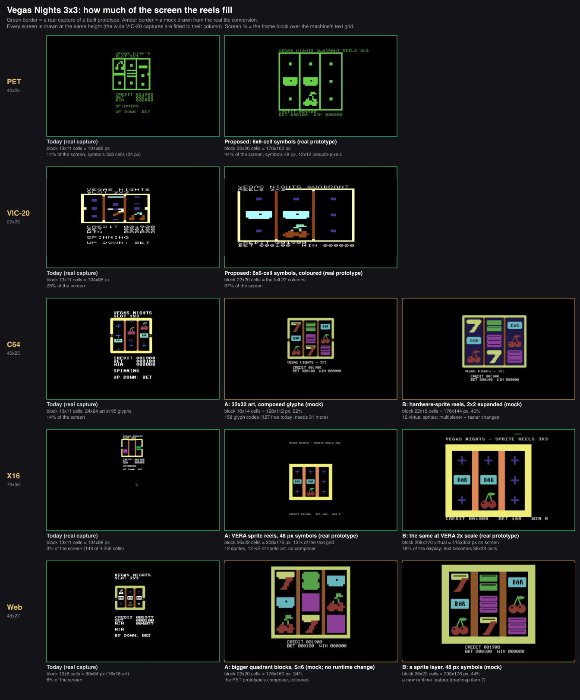
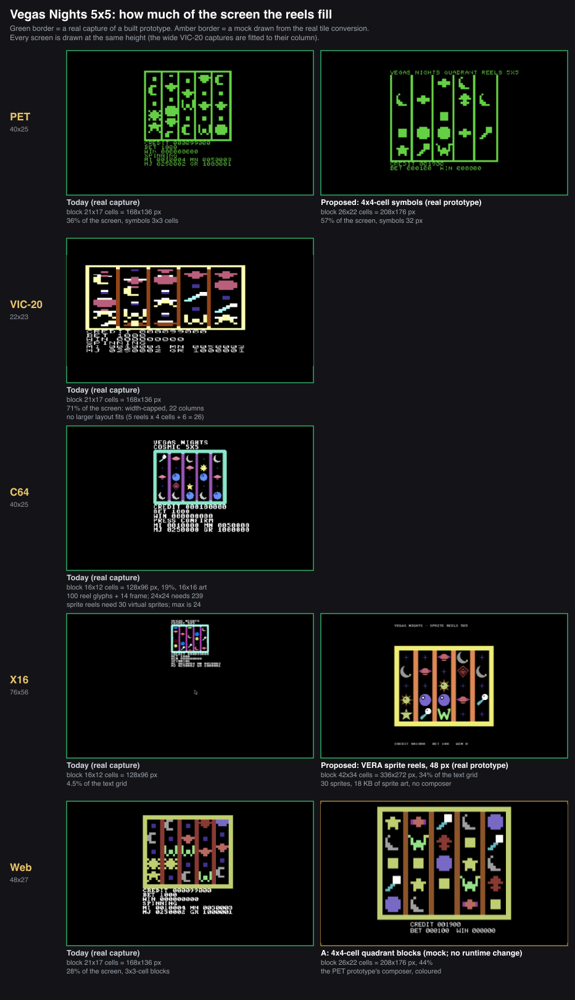

# Bigger reels — what each machine can do, measured

*Design note, 2026-10-04. The owner played the slots and wants the playfield larger: the reels should fill
the screen more. This note measures what the reels fill today, works out the arithmetic that sets the limit on
each machine, and reports what was built and run to find out what a larger layout costs. **Nothing here changes
a shipped lab.** The prototypes are `proto-*` programs (`8bitscript.config.8bs`), the numbers are from
headless runs, and the decisions at the end are the owner's.*





*Green border: a real capture of a program built and run for this note. Amber border: a mock drawn from the
real tile conversion (`tools/tiles`) — the art is what the hardware would get, the text is a stand-in font.*

## The short version

| machine | 3x3 today → proposed | 5x5 today → proposed | how | built? | effort |
| --- | --- | --- | --- | --- | --- |
| PET | 14% → **44%** | 36% → **57%** | bigger quadrant symbols (6x6 and 4x4 cells), a table-driven composer and a 6502 whole-cell hop | real prototype, measured | M |
| VIC-20 | 28% → **87%** | 71% (width-capped) | the same, coloured | real prototype, measured | M |
| C64 | 14% → **22%** (A) or **40%** (B) | 19% (stays) | A: 32x32 art in the glyph composer. B: hardware-sprite reels | mock only | A: M, B: L |
| X16 | 3% → **13%** (1x) or **48%** (2x scale) | 4.5% → **34%** | VERA sprite reels, no composer | real prototype | M (2x: L) |
| web | 6% → **34%** (A) or **44%** (B) | 28% → **44%** | A: the PET composer on the host's block glyphs, no runtime change. B: a sprite layer | mock only | A: S–M, B: L |

"%" is the frame block over the machine's text grid (the X16's 2x figure is of the 640x480 display).

Three things the measurements settled:

1. **A bigger reel is slower to redraw in proportion to its cells, and the way out is not a faster loop but a
   different scroll.** Recomposing a 6x6-cell reel every 4 pixels costs 3.1x what today's reel does on the PET (so
   the reels would spin at a third of today's pace); moving whole cell rows and composing only the new top row, as a
   6502 block copy, makes the *bigger* reels 2.7x (PET) and 2.9x (VIC-20) *faster* than today's (§3.1).
2. **The X16 should stop composing and use its sprites.** Reels as stacks of VERA sprites cost the CPU nothing,
   run on the real art, and are the only route that fills a 640x480 screen (§3.2).
3. **The C64 is the hard one.** Its glyph budget caps the 3x3 at 22% and the 5x5 where it is, and the sprite
   route needs changes to the multiplexer and the raster list that the bonus round's copper bars already
   use up (§3.3).

## 1. What the reels fill today (measured)

Block = the frame, dividers and reels, in text cells, from the labs' own geometry constants (`view.8bs`,
`quad.8bs`) and checked against real captures (`reel-size/today/`).

| machine | text grid | 3x3: block, symbol | 3x3 fill | 5x5: block, symbol | 5x5 fill |
| --- | --- | --- | --- | --- | --- |
| PET | 40x25 = 1,000 | 13x11 = 143, 3x3 cells (24 px) | **14.3%** | 21x17 = 357, 3x3 cells | **35.7%** |
| VIC-20 (8K) | 22x23 = 506 | 13x11 = 143, 3x3 cells | **28.3%** | 21x17 = 357, 3x3 cells | **70.6%** |
| C64 | 40x25 = 1,000 | 13x11 = 143, 3x3 cells | **14.3%** | 16x12 = 192, 2x2 cells (16 px) | **19.2%** |
| X16 | 76x56 = 4,256 | 13x11 = 143, 3x3 cells | **3.4%** | 16x12 = 192, 2x2 cells | **4.5%** |
| web | 48x27 = 1,296 | 10x8 = 80, 2x2 cells (16 px) | **6.2%** | 21x17 = 357, 3x3 cells of blocks | **27.5%** |

So the "third of the screen" the owner sees is the PET and the web's 5x5; on the X16 the 3x3 is a postage stamp
(105x88 pixels in 640x480) because the same cell count sits on a grid with more than four times the cells.

Why each machine is the size it is, in glyphs and cells:

| machine | what limits it today |
| --- | --- |
| PET, VIC-20, web (5x5) | the ROM's sixteen 2x2 block glyphs: nothing to redefine, so no glyph budget — but a symbol is only 6x6 pseudo-pixels, and every cell of every reel is rewritten as it scrolls |
| C64 | **127 free glyph codes** (128–255). The 3x3 uses 3 reels x (3 symbols x 3 cell rows) x 3 cells = 81, plus 14 for the frame = **95**. The 5x5 at 2x2 cells uses 5 x (5 x 2) x 2 = 100, plus 14 = **114** |
| X16 | the same composer and the same 127 codes (128–255 of the ISO set), though the screen has room for ten times more |
| web | an **80-glyph** table (codes 176–255). The 3x3 at 3x3 cells needs 95, so it was cut to 2x2 cells (50) |
| VIC-20 | 22 columns: a 5x5 with 3-cell symbols is 5 x 3 + 6 = 21 wide; the next size (4 cells) would be 26 |

Composer cost today, in video frames per reel redraw (`scripts/measure-redraw.mjs`, headless, NTSC on this
Mac): **PET 0.37**, **VIC-20 0.90**, **C64 0.57**, **X16 0.27**. With three reels that is 1.1, 2.7, 1.7 and 0.8 frames to move all
the reels one step, which is where the README's "12 px every 3rd frame" comes from.

## 2. What was built

All under `src/labs/proto-*`, data and sources generated by `tools/size/` (nothing hand-edited):

| program | machines | what it is |
| --- | --- | --- |
| `proto-quad-3x3`, `proto-quad-5x5` | PET, VIC-20 | the reels from quadrant blocks at 6x6 cells (3x3) and 4x4 cells (5x5), scrolling by pseudo-pixel row; `REPS`/`HOP` defines run the redraw-cost measurements; `HOP=1` moves cells in compiled code, `HOP=2` as a 6502 block copy |
| `proto-x16-3x3`, `proto-x16-5x5`, `proto-x16-3x3-2x` | X16 | VERA sprite reels from the real 48x48 art masters; `-2x` sets VERA's 2x display scale |
| mocks (`tools/size/mock.mjs`) | C64, web | the routes not built: C64 32x32 glyphs and sprite reels, the web's bigger blocks, a bigger glyph table and a sprite layer |

None of them has game logic: reels spin on fixed stops; `REST=1` holds them. They exist to measure.

## 3. What the prototypes found

### 3.1 PET and VIC-20: bigger quadrant symbols, and scrolling by whole cells

**The art.** A symbol becomes S x S cells of the ROM's 2x2 blocks, 2S x 2S pseudo-pixels, resampled from the
48x48 master the same way the shipped tiles are. S = 6 on the 3x3 (12x12 pseudo-pixels, 48 screen pixels, twice
today's height) and S = 4 on the 5x5 (32 px). The pipeline's quadrant converter refuses more than 4 cells
(`toQuadSymbol`), so the prototype generates its own data from the same resampler; shipping it means lifting
that limit.

**The composer.** A display cell takes two consecutive pseudo-pixel rows, so its screen code is one of three
precomputed tables — `C0` (a pair starting on an even row), `C1` (odd), `CX` (the odd pair that straddles two
symbols) — and a redraw is one table read and one write per cell. 612 bytes of tables for six symbols (576 for the
nine of the 5x5), index arithmetic done at 16 bits (the 5x5's `CX` has 324 entries).

**What it costs, measured** (frames, headless; "step" = 4 pixels, "hop" = 8 pixels):

| | cells a reel | step (recompute) | hop, compiled | **hop, 6502 block copy** |
| --- | --- | --- | --- | --- |
| today's PET 3x3 | 27 | 1.11 frames / 4 px = 3.6 px/frame | | |
| PET 3x3, S=6 | 108 | 3.42 frames = 1.2 px/frame | 2.73 frames = 2.9 px/frame | **0.81 frames = 9.9 px/frame** |
| PET 5x5, S=4 | 80 | 4.44 frames = 0.9 px/frame | 3.42 frames = 2.3 px/frame | **1.02 frames = 7.8 px/frame** |
| today's VIC-20 3x3 | 27 | 2.70 frames / 4 px = 1.5 px/frame | | |
| VIC-20 3x3, S=6 (coloured) | 108 | 7.47 frames = 0.5 px/frame | 6.00 frames = 1.3 px/frame | **1.80 frames = 4.4 px/frame** |

(All three reels; today's figures are the shipped composer's 0.37 and 0.90 frames per reel x 3.)

Recomposing is linear in cells (4x the cells costs 3.1x and 2.8x: the table route is ~20–30% cheaper per cell than
the shipped composer), so a bigger window is simply slower — **3x slower on the PET, 3x slower on the VIC-20**.
A **hop** avoids it: when the window scrolls a whole cell row, every cell is the one above it, so the reel moves
down by copying its rows (18 cycles a byte) and only the new top row is composed from the table. Compiled that is
2.5x better per pixel; as a 6502 block copy (`tools/size/quad-shared/move.8bs`, 30 lines) it is about 3.4x
better again, and the remaining cost is the compiled top-row compose. Result: **bigger reels, faster than today**
(9.9 vs 3.6 px/frame on the PET, 4.4 vs 1.5 on the VIC-20).

**Verified**: after 20 hops the screen is byte-identical to 40 single-row recomputes and to the compiled hop, on
the PET and the VIC-20 (the PNGs have the same MD5), so the hop is not a different picture, only a cheaper way to
the same one.

**Known costs**: a hop moves 8 pixels at a time, so a fast spin looks like cell jumps (as it does today in
12-pixel hops); the final easing to a stop needs 4-pixel positions, which is the slow recompute path (a few frames at
the end of a spin, where the reels are slow anyway). The win flash (symbols inverted) needs the tables' complement
codes; the PET has no colour, the VIC-20's per-cell ink table is 216 bytes more.

**Sizes**: PET 3x3 prototype 2,824 bytes of program, 50 bytes of RAM; VIC-20 3,336 / 52; PET 5x5 2,620 / 50. The
shipped 3x3 is 6,008 (PET) and 6,376 (VIC-20) with the game, so this adds tables, not code.

**The web** shares this composer (its 5x5 already uses the PET's with block glyphs 128–143), so the numbers carry
over: S=6 on the 3x3 and S=4 on the 5x5 are a 34% and a 44% fill with **no runtime change** (mock, `sheet-3x3.png`,
`sheet-5x5.png`). Only the codes differ (`128 + pattern`) and the host does the colour per cell.

**The VIC-20 5x5 cannot grow**: 22 columns hold 5 reels of 3 cells and the dividers (21); 4-cell symbols need 26. A
5x5 on the VIC-20 stays as it is (71% of the screen already).

**The PET and web screens have spare room**: S=6 uses 22 of 40 columns, so the credit/bet/win and the jackpot
meters can go beside the reels instead of under them.

### 3.2 X16: reels as VERA sprites

**What was built.** A reel is a stack of 64x64 4-bit sprites on a 48-pixel pitch (the 48x48 master sits in the
middle of its sprite; the clear margins overlap), one sprite per visible symbol plus one entering: 12 sprites for
the 3x3, 30 for the 5x5. Scrolling a reel is writing each sprite's Y; when the stack has moved a symbol the
sprites take the next strip symbols by changing their address. The CPU never touches a pixel.
Symbols: 2,048 bytes each, **12 KB (3x3) and 18 KB (5x5) of sprite art** in the program image, uploaded once
(`tools/size/gen-x16.mjs`; programs of 14,938 and 21,054 bytes).

**Hiding the overflow.** A sprite that is leaving or entering would show above and below the window. The rows
above and below are opaque cells of the *text layer*, which draws over sprites at z-depth 2. The prototype uses
palette entry 11 as an opaque black for that (`screen.blank()` paints transparent black, index 0); a shipped
version should claim an entry above 127 like the graphics twin does.

**Results (real x16emu captures, `reel-size/proto/`).**

| | window | block | fill |
| --- | --- | --- | --- |
| today 3x3 | 72x72 px | 104x88 | 3.4% of the text grid |
| 3x3, 1x | 176x144 px | 208x176 | 13.4% |
| 3x3, VERA 2x scale | 352x288 on screen | 416x352 | **47.7% of the display** |
| today 5x5 | 80x80 px | 128x96 | 4.5% |
| 5x5, 1x | 304x240 px | 336x272 | **33.6%** |

At 1x the 3x3 is still small because a 48-pixel symbol is small on a 608x448 area; the 5x5 is the one that fills it.
**VERA's 2x scale** (`DC_HSCALE`/`DC_VSCALE` = 64) draws the whole composition at 320x240, doubling every
sprite and cell: the prototype shows the 3x3 filling 65% of the width and 73% of the height with the same art and
no extra work. Its price is that the text becomes a 38x28-cell grid, and `@8bitscript/cx16`'s `text.COLUMNS` is a
76 constant, so a 2x X16 is a recorded decision plus a text-layer change (L), not a flag.

**CPU**: ~8 VRAM writes a sprite a frame (12 or 30 sprites): about 1.6K and 4K cycles of 133K at 8 MHz, i.e. 1–3%.
Both programs run at the full frame rate and reels move by 8 pixels a frame. For comparison today's composer is 0.27 frames a reel (0.8 a step) on the X16, a CPU cost the sprite route removes.

**Caveats (not verified)**:
- **Sprites per line.** Up to two sprites of one reel overlap on a line (the 16-pixel margin), so the 5x5 can put
  10 64-pixel sprites on a line. `packages/cx16/AGENTS.md` gives a 798-cycle line budget and 99–147 cycles for a
  64-pixel 8-bpp sprite, so 4-bpp is lighter but 10 is close. No sprite dropped in any capture (x16emu renders them
  all); real hardware is untested. Using 64-pixel art (no overlap) halves the load.
- A stray row of pixels appears at the very top of the 2x capture at rest (a sprite whose art starts above the
  active area); it is not in the spinning capture and was not chased.
- `graphics.place` objects (MAX 8) are not used: the reels write VERA directly. The graphics contract asked for a
  "same picture twice" call for exactly this reason (`docs/project/graphics.md`).
- Interplay with the raster bonus bars (VERA IRQ writes and sprite attribute writes share the data port), the win
  flash (draw a sprite on top, or recolour the palette block) and sound are untried.

### 3.3 C64: two routes, neither cheap

**A. 32x32 art in the glyph composer (mock).** 4x4 cells a symbol: a 3x3 window is 3 reels x (3 x 4 rows) x 4 cells =
**144 glyphs + 14 frame = 158**, against **127 free codes** (128–255). 31 more are available by taking codes the text never
prints: in the mixed-case set the game uses, 0–31 (@ and a–z: the UI is upper case) and 91–127 (graphics) are
free, 127 + 32 + 37 = 196 (to verify against the text package on a build). The assembly composer
(`glyphs.c64.8bs`, ~300 lines) is specialised to three-cell-wide symbols, so this means a generalised
composer and a code remap for a non-contiguous range. Gain: block 16x14 cells, **22%** (from 14%), window 96x96
px (1.8x today's area). 40x40 art does not fit (3 x 15 x 5 = 225 + 14 = 239). **The 5x5 cannot grow this way**: 24x24
needs 225 + 14 = 239 glyphs; it stays at 16x16 art (100 + 14).

**B. Hardware-sprite reels (mock, from real conversion).** Each reel is a vertical stack of sprites: 24x21 hi-res
sprites expanded 2x2 are 48x42 symbols; three reels are a 144x126-pixel window (**40%** with the frame; the mock
`sheet-3x3.png` shows the look: 1 colour a symbol, the chunky blocks of expanded pixels — the shipped sprite
conversion also takes one colour a sprite). Per scanline a reel shows one sprite, so three per line: fine against
the limit of 8. The blockers are in the toolchain:
- **12 virtual sprites on 8 hardware** needs the multiplexer; `packages/c64/src/multiplex.8bs` assumes **21-line
  sprites** (`GAP = 24`, "free from line a + 21 on") and shares the expand bits across a hardware sprite. Expanded
  sprites need a per-build `GAP` of 45 and the multiplexer re-checked (the reuse distances here are 84+ lines, so it
  can work).
- **The raster list is the contested resource.** The multiplexer writes the same 63-entry list the bonus round's
  copper bars use (**54 of 63 entries**, `fx.c64.8bs`), and `graphics.update()` clears the list each frame
  (`packages/c64/AGENTS.md`; the `fancy` regression). Sprites and bars would have to share the list: the portable
  raster layer owning the program's entries, which is a separate design.
- **The 5x5 is out**: 5 reels x (5 visible + 1 entering) = **30 virtual sprites; the multiplexer holds 24**.

### 3.4 Web: three levels

| level | what | fill | runtime change |
| --- | --- | --- | --- |
| A | the PET composer on the host's block glyphs, S=6 (3x3) and S=4 (5x5), coloured | 34% and 44% | none |
| B | a bigger glyph table so the pixel composer can use 24x24 art (95 glyphs) or 32x32 (158) | 11% / 17% (3x3), real pixel art | the table is 80 glyphs at codes 176–255; codes 123–127 and 144–175 are unused by the font, so **117** fit with a layout change (S); 158+ needs the table to cover more of the 256 codes (M) — both renderers and the loader must stay pixel-identical |
| C | a sprite layer: 48 px symbols as on the X16 | 44% (3x3) | a new runtime feature, item 7 of the web roadmap (L) |

A is the same work as the PET (the same composer, the web's codes `128 + pattern`). B changes quality, not size. C is
the web's route to the X16 look and is a separate series. The web's screen is 384x216 pixels, so a 5x5 of 48-pixel
sprites (240 px) does not fit its height; the 5x5 would use S=4 blocks (A) or 32-pixel sprites.

## 4. Recommendation

| machine | route | glyphs / sprites | reel speed | risk | effort | depends on |
| --- | --- | --- | --- | --- | --- | --- |
| PET | bigger quadrant symbols + 6502 hop | 0 glyphs; 612 B tables | **9.9 px/frame** (today 3.6) | low | M | pipeline: quadrant symbols over 4 cells; a stop path for 4-px positions |
| VIC-20 | the same, coloured (3x3 only) | 0; 216 B inks | **4.4 px/frame** (today 1.5) | low | M | as PET; colour memory moved with the cells |
| C64 | A: 32x32 glyph composer (3x3 only); keep 5x5 | 158 of ~196 free codes | like today's | medium | M | a generalised assembly composer; a code remap; (text must stay upper case) |
| C64 | B: sprite reels (3x3 only) | 12 virtual sprites | none (CPU-free) | **high** | L | multiplexer `GAP` for expanded sprites; sprites + bonus bars sharing the raster list |
| X16 | VERA sprite reels (1x) | 12 / 30 sprites, 12 / 18 KB art | 8 px/frame, ~1–3% CPU | low–medium | M | an opaque-black palette entry; the line budget on hardware |
| X16 | + VERA 2x scale (3x3) | same | same | medium | **L** | a 38x28 text grid (`text.COLUMNS` is 76) |
| web | A: bigger blocks (3x3, 5x5) | 0 | like the PET | low | S–M | the PET work |
| web | B: bigger glyph table, then C: a sprite layer | 95–158 / sprites | | medium / high | S–M / L | runtime changes |

If one thing is built first: **the PET/VIC-20/web quadrant composer with the hop**, because three machines share it,
the speed gain is measured, and it needs no toolchain change. Second the **X16 sprite reels**, because that is where
the screen is wasted most.

## 5. Decisions for the owner

1. **What "fills the screen" should mean per machine.** The hardware gives different answers: PET 44–57%, VIC-20
   87% (3x3), C64 22–40%, X16 13–48%, web 34–44%. Is "the largest the hardware allows, per machine" right, or should
   all five show the same *proportion*? (The first is cheaper and what the prototypes show.)
2. **The X16 at 1x or 2x.** 1x gives a 13% 3x3 and a 34% 5x5 with no toolchain change; 2x gives 48% but makes the text
   grid 38x28. A graphics-only 2x screen with its own panel drawn from sprites avoids the text package, at the cost of
   a second code path.
3. **The C64: A, B, or neither.** A is bounded (22%) but safe; B is the big look (40%) and drags in the multiplexer,
   the raster list and the bonus bars — it should wait for the raster-and-sprites coexistence work. Both leave the
   5x5 as it is.
4. **The reel speed target.** The hop scrolls 8 pixels a frame (6 frames a 48-px symbol; today 24-px symbols at 3.6 px
   is about 6.7). If that cadence is right, bigger reels are free. A finer spin than 8 px means the slow path for
   the whole spin.
5. **Art.** Bigger symbols want art authored for them: the pseudo-pixel conversion of a 48x48 master loses detail
   (the BAR lettering disappears at 12x12); the sprite machines want 48 or 64 px masters. Redraw per size, or accept
   the downsample.
6. **The rest of the screen.** The PET and web have 18 spare columns at S=6, the X16 most of its screen. A cabinet
   around the reels (jackpot meters above, paytable and buttons below, marquee lights) fills a screen without
   enlarging a single reel and costs no glyph budget on the machines that have room. Worth a separate pass?

## 6. How to reproduce

```sh
export EIGHTBS_CHECKOUT=/path/to/8bitscript               # the prototypes use #define, on 8BitScript's trunk
node tools/size/gen-quad.mjs && node tools/size/gen-x16.mjs   # regenerate src/labs/proto-*/data.8bs and main.8bs
node tools/size/capture-today.mjs                              # real captures of today's labs -> docs/reel-size/today/
node tools/size/mock.mjs && node tools/size/sheet.mjs          # the mocks and the two sheets
node tools/size/measure-quad.mjs                               # the redraw-cost measurements of §3.1 (minutes)
node scripts/measure-redraw.mjs pet vic20 c64 cx16             # today's composers, for comparison
8bs run pet   --program proto-quad-3x3 --define REST=1 --screenshot out.png
8bs run cx16  --program proto-x16-5x5  --define SPEED=8 --frames 400 --screenshot out.png
```

Captures of the prototypes are in `docs/reel-size/proto/`, mocks in `docs/reel-size/mock/`.

## What was not verified

- Real hardware, a real browser tab and PAL: everything is emulator-measured, NTSC.
- The hop beside the rest of a spin (the easing to a stop, the win flash, the bonus bars, sound): the prototypes
  prove the picture and the cost of the hop, not a whole game on it.
- The VERA per-line sprite budget with 10 64-pixel sprites on a line, on hardware.
- The C64 routes: both are mocks; the glyph-code arithmetic assumes the text package prints upper case only.
- The web routes: all mocks.
